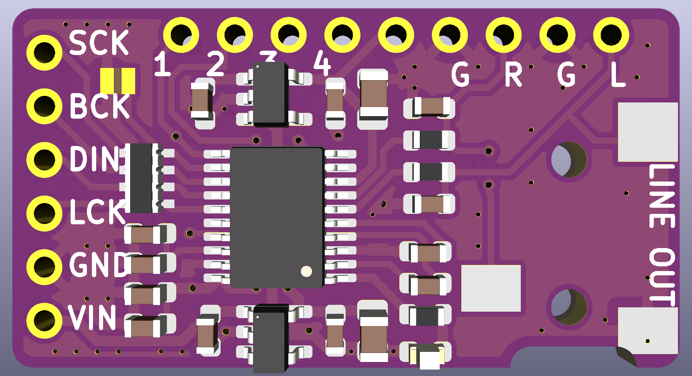
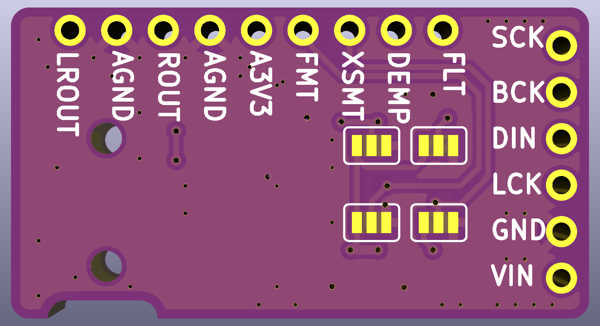
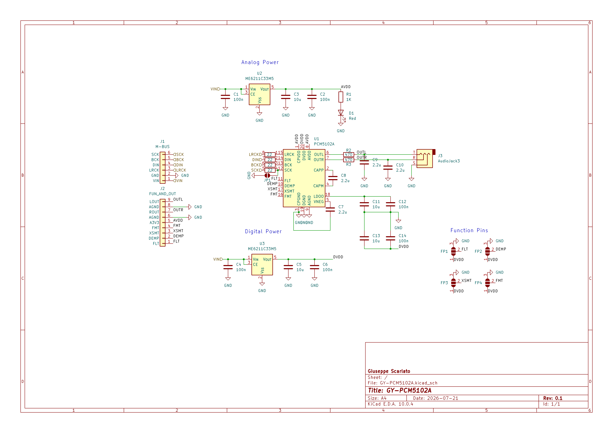

# KiCad GY-PCM5102A

Open source recreation of the popular GY-PCM5102A I2S DAC module, built in KiCad.

## PCB renders

## Schematic

## License & Attribution

This project is an independent, open-source recreation based on the GY-PCM5102A modules.

Licensed under the [CERN Open Hardware Licence Version 2 - Strongly Reciprocal (CERN-OHL-S)](LICENSE).

Copyright (c) Giuseppe Scarlato 2026.